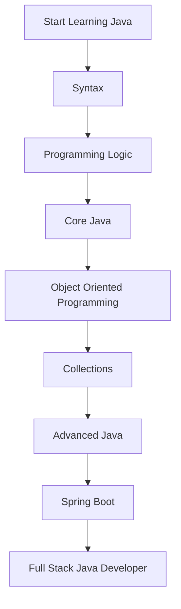

<div align="center">

# ☕ Basic Java

### Learning Java • One Program at a Time 🚀


---


</div>

---

# 📖 About

This repository contains my Java learning journey from beginner fundamentals to advanced concepts.

Every program is written while learning Java and focuses on understanding programming logic, syntax, and problem-solving.

---

# 🧠 Learning Flow

```mermaid
flowchart LR

A[Hello World]
-->B[Variables]

B-->C[Scanner Input]

C-->D[Operators]

D-->E[Type Casting]

E-->F[Boolean]

F-->G[If Else]

G-->H[Switch]

H-->I[Loops]

I-->J[Break Continue]

J-->K[Methods]

K-->L[Arrays]

L-->M[Exception Handling]

M-->N[Strings]

N-->O[OOP]

O-->P[Collections]

P-->Q[File Handling]

Q-->R[Multithreading]
```



---

# 📂 Programs

| Java File | Concept |
|------------|---------|
| `Main.java` | Hello World |
| `variable.java` | Variables |
| `input.java` | Scanner Class |
| `casting.java` | Type Casting |
| `boolian.java` | Boolean |
| `add.java` | Operators |
| `swech.java` | Switch Statement |
| `loop.java` | For, While, Do-While |
| `breakandcontinue.java` | Break & Continue |
| `methods.java` | Methods |
| `arrays.java` | Arrays |
| `exceptionhandling.java` | Exception Handling |

---

# 📈 Learning Progress

```text
██████████████████░░░░░░░░░░░░░░░░░░░░ 40%

Completed

✔ Java Basics
✔ Variables
✔ Scanner
✔ Operators
✔ Type Casting
✔ Boolean
✔ If Else
✔ Switch
✔ Loops
✔ Break Continue
✔ Methods
✔ Arrays
✔ Exception Handling

Coming Next

⬜ Strings
⬜ Object Oriented Programming
⬜ Collections
⬜ File Handling
⬜ Generics
⬜ Multithreading
⬜ JDBC
⬜ Networking
```

---

# ⚙️ Project Structure

```
Basic-Java/

├── Main.java
├── variable.java
├── input.java
├── casting.java
├── boolian.java
├── add.java
├── swech.java
├── loop.java
├── breakandcontinue.java
├── methods.java
├── arrays.java
├── exceptionhandling.java
└── README.md
```

---

# ▶️ Run Java Program

Compile

```bash
javac FileName.java
```

Run

```bash
java FileName
```

Example

```bash
javac arrays.java

java arrays
```

---

# 🎯 Goals

- Build strong Java fundamentals
- Improve problem-solving
- Learn Data Structures & Algorithms
- Master Object-Oriented Programming
- Become proficient in Backend Development
- Explore Spring Boot
- Apply Java in Full Stack Development

---

# 🚀 Repository Status



---

<div align="center">

### ⭐ Thanks for visiting!

*This repository is continuously updated as I progress through my Java learning journey.*

</div>
